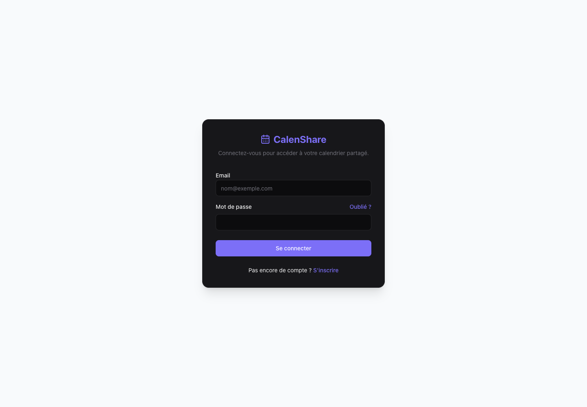

# CalenShare : calendrier partagé

## Le projet en quelques mots

Je conçois un outil pour organiser des événements à plusieurs : voir un calendrier, proposer une date, indiquer ses disponibilités et voter sur les propositions.

Le travail conservé comprend les vues du calendrier, les événements, les disponibilités, les propositions de dates, les réactions et les écrans de connexion.

Ce projet montre ma recherche d'un parcours simple pour organiser une activité collective. Le nom du dossier GitHub, `le-mazet`, est un ancien nom ; le projet présenté s'appelle CalenShare.

## Comment le découvrir

La capture ci-dessous peut être consultée sans installation. Elle montre l'écran de connexion du prototype. Pour utiliser le calendrier complet, il faut encore configurer et vérifier le service qui gère les comptes et les données.

Le ZIP est destiné à une reprise technique. Une personne qui souhaite simplement découvrir le travail peut lire la fiche et regarder la capture, sans suivre les commandes ci-dessous.

## Détails pour reprendre le projet

<details>
<summary>Capture, configuration et limites techniques</summary>

## En bref

**Ce que c’est :** un prototype de calendrier partagé nommé CalenShare.

**À quoi il sert :** organiser des événements, comparer des disponibilités, voter sur des dates, ajouter des réactions et suivre les contributions ou pièces jointes.

**Ce qui a été réalisé :** vues mensuelle et annuelle, événements, disponibilités, propositions de dates, réactions, contributions et interface d’authentification conservée.

**Technologies :** Next.js, React, TypeScript, Tailwind CSS et Supabase (Auth, PostgreSQL, RLS, Storage, Realtime).

Le dépôt décrit une reprise technique pour portfolio. L’instance Supabase réelle et le parcours complet restent à valider.



La capture montre l’écran public avec une configuration synthétique ; aucune connexion ni donnée de calendrier réelle n’a été utilisée. Le branding CalenShare historique est conservé.

## Stack

Next.js 16.1.6, React 19.2.3, TypeScript et Tailwind CSS 4. Supabase fournit Auth, PostgreSQL, des politiques RLS, Storage et Realtime. `package-lock.json` enregistre les versions exactes des dépendances.

## Relancer sur une instance de test personnelle

1. Utiliser Node.js 22.x, demandé par `package.json`, puis exécuter `npm ci`.
2. Copier `.env.example` dans `.env.local` et renseigner les trois valeurs avec sa propre instance Supabase de test. Les champs vides sont des placeholders, pas une configuration fonctionnelle. Ne jamais utiliser une clé `service_role` dans une variable `NEXT_PUBLIC_*`.
3. Préparer le schéma uniquement sur cette instance de test. `supabase/schema.sql` est une base historique ; les autres fichiers ajoutent et modifient tables, politiques, fonctions, stockage et Realtime. Ils ne constituent pas une chaîne de migrations reproductible validée. Certains réinitialisent des politiques ou retirent des groupes : ne pas les exécuter automatiquement ni les appliquer à une base existante. Vérifier leurs dépendances et leur ordre avant application. Les réactions nécessitent `18_add_event_reactions.sql` ; le calendrier utilise la RPC `get_calendar_events` de `15_security_fixes.sql`.
4. Configurer les URL de redirection Auth pour l'URL locale choisie, puis lancer `npm run dev` et ouvrir `http://localhost:3000`.

```sh
npm ci
npm run dev
```

Pour vérifier et construire :

```sh
node --test tests/event-reactions.test.cjs
npx tsc --noEmit
npm run build
npm start
```

`npm start` nécessite un build réussi. Les sources publiques ne contiennent pas de données personnelles.

Si Turbopack reste bloqué, `npm run build -- --webpack` est une alternative vérifiée ici. Sans les trois variables publiques, ce mode compile mais échoue ensuite à collecter les pages. Avec des valeurs de test synthétiques pointant vers un port local sans serveur, le build complet réussit : cela valide la compilation, pas Supabase ni l’authentification. Pour réellement utiliser le calendrier, renseigner sa propre instance de test et valider son schéma.

## Vérification et limites

Voir `VERIFICATION.md` pour les résultats exacts. La préparation corrige les trois exports de requêtes de réactions qui manquaient et empêchaient la compilation TypeScript. Les tests utilisent un client synthétique : ils vérifient les paramètres, le mapping et les retours d'erreur sans contacter Supabase. Ils ne prouvent pas les politiques RLS, les contraintes SQL, les abonnements Realtime ni les parcours multiutilisateurs.

Aucune instance Supabase, migration, donnée de production, clé privée ou déploiement n'a été utilisé. Les parcours connexion, inscription, récupération de mot de passe, calendrier, votes, réactions et pièces jointes restent à vérifier sur une instance de test. Aucune capture de calendrier rempli n'est disponible.

Les écrans de connexion desktop et mobile ont été réellement rendus dans Chromium. À 390px, le document mesure 390px ; aucun formulaire soumis ni erreur applicative observée sur cet écran. Une remarque navigateur sur autocomplete est présente. Ce contrôle ne valide pas un parcours connecté.

L'installation préparatoire a signalé 77 vulnérabilités (6 critiques, 50 élevées, 19 modérées et 2 faibles) et un écart entre Node 26.7.0 installé et Node 22.x demandé. Aucune mise à niveau globale automatique n'a été appliquée. Une reprise doit analyser ces dépendances avant toute mise en production, valider les scripts SQL sur une base vierge et tester les autorisations avec plusieurs comptes.

## Dépôt et téléchargement

[Voir le dépôt](https://github.com/cpointis96-hue/le-mazet) · [Télécharger les sources ZIP](https://github.com/cpointis96-hue/le-mazet/archive/HEAD.zip). Le ZIP contient les sources ; il ne fournit ni instance Supabase ni application prête pour la production.

</details>
